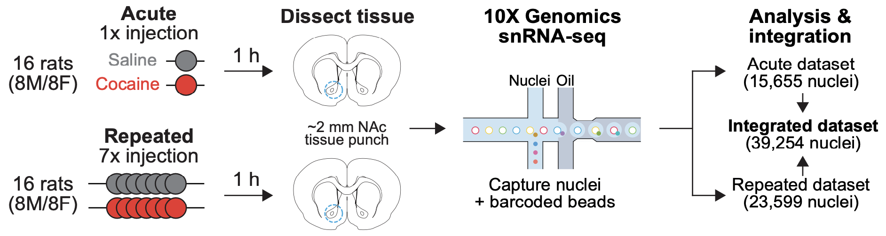

# Adult Rat NAc
This repository contains R code for analysis of single nucleus RNA-sequencing datasets from the adult rat NAc and for analysis of RNAscope imaging data. 

# Study design
A previously published snRNA-seq dataset  from [_A dopamine-induced gene expression signature regulates neuronal function and cocaine response_](https://advances.sciencemag.org/content/6/26/eaba4221) was integrated with a novel dataset containing NAc nuclei from male and female Sprague-dawley rats that were injected with seven consecutive doses of saline or cocaine. Overall, this dataset contains samples from two separate experiments and eight experimental groups: 

&nbsp;&nbsp;&nbsp;&nbsp; **Acute** - Rats received a single dose of saline or cocaine

1. Male adult rats, 1hr following first saline injection
2. Male adult rats, 1hr following first cocaine injection (20mg/kg, I.P.)
3. Female adult rats, 1hr following first saline injection
4. Female adult rats, 1hr following first cocaine injection (20mg/kg, I.P.)

&nbsp;&nbsp;&nbsp;&nbsp; **Repeated** - Rats received seven consecutive doses of saline or cocaine

5. Male adult rats, 1hr following seventh saline injection
6. Male adult rats, 1hr following seventh cocaine injection (20mg/kg, I.P.)
7. Female adult rats, 1hr following seventh saline injection
8. Female adult rats, 1hr following seventh cocaine injection (20mg/kg, I.P.)
 
 

 

# Citations
Savell, K.E.*, Tuscher, J.J.*, Zipperly, M.E.*, Duke, C.G.*, Phillips III, R.A.*, Bauman, A.J., Thukral, S., Sultan, F.A., Goska, N.A., Ianov, L., & Day, J.J. (2020). A dopamine-induced gene expression signature regulates neuronal function and cocaine response. *Science Advances* 6(26): eaba4221.
[Link](https://advances.sciencemag.org/content/6/26/eaba4221)

Phillips III, R.A., Tuscher, J.J., Fitzgerald, N.D., Wan, E., Zipperly, M.E., Duke, C.G., Ianov, L., Day, & Day, J.J. (2023). Distinct subpopulations of D1 medium spiny neurons exhibit unique transcriptional responsiveness to cocaine. *bioRxiv* [Link](https://www.biorxiv.org/content/10.1101/2023.01.12.523845v1). 

# Raw data
Acute cocaine, adult rat NAc snRNA-seq - GEO accession [GSE137763](https://www.ncbi.nlm.nih.gov/geo/query/acc.cgi?acc=GSE137763)  
Repeated cocaine, adult rat NAc snRNA-seq - GEO accession[GSE222418](https://www.ncbi.nlm.nih.gov/geo/query/acc.cgi?acc=GSE222418)  
